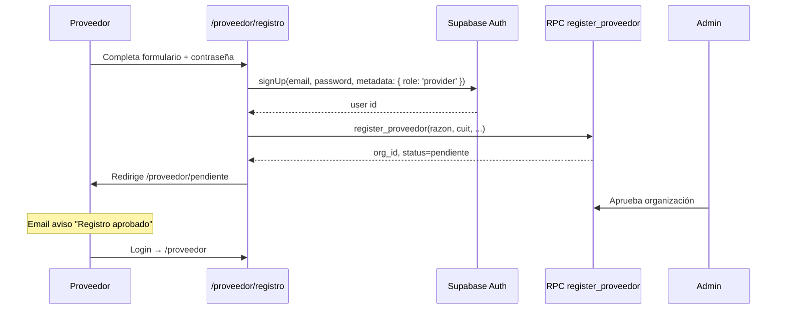

# Fase 1 — Portal de Proveedores EMPRENOR

**Versión:** 1.0 · **Alcance:** 90 días · **Estado:** Listo para implementación  
**Migración SQL:** `scripts/migrate-portal-proveedores.sql`  
**Prerequisitos:** `migrate-licitaciones-portal.sql`, bandeja/notificaciones, SMTP en Vercel

---

## 1. Objetivo de negocio

> **Cero ofertas recibidas solo por email** en licitaciones con portal digital activo.

El proveedor registrado y aprobado puede:

1. Ver licitaciones abiertas  
2. Descargar pliegos y plantillas (itemizado, Gantt, especificaciones)  
3. Armar su oferta en borrador  
4. Subir documentación obligatoria  
5. Enviar oferta sellada (sin edición posterior)  
6. Consultar el estado de evaluación  

EMPRENOR (staff) puede:

1. Aprobar / rechazar / suspender proveedores  
2. Definir requisitos documentales por licitación  
3. Ver y descargar todas las ofertas recibidas  
4. Cambiar estado de oferta (en evaluación → adjudicada / no seleccionada)  

---

## 2. Fuera de alcance (Fase 1)

| No incluido | Fase futura |
|-------------|-------------|
| Portal cliente / seguimiento de obra | Fase 2–3 |
| Formulario web del itemizado (solo upload Excel) | Fase 4 |
| Comparador automático de partidas | Fase 4 |
| Firma digital / AFIP | Fase 5 |
| Multi-usuario por empresa (varios miembros) | Fase 2 (solo owner en MVP) |
| Notificaciones push / app móvil | Backlog |

---

## 3. Arquitectura

```
┌─────────────────────────────────────────────────────────────┐
│  Sitio público (Ferozo + Vercel)                            │
│  /licitaciones → /licitaciones/:id (ya existe)              │
│  /proveedor/registro · /proveedor/login · /proveedor/*      │
└──────────────────────────┬──────────────────────────────────┘
                           │ Supabase Auth + RLS
┌──────────────────────────▼──────────────────────────────────┐
│  Supabase                                                   │
│  organizaciones · proveedor_miembros · licitacion_ofertas     │
│  oferta_documentos · licitacion_requisitos                  │
│  Bucket público: licitacion-docs (pliegos EMPRENOR)         │
│  Bucket privado: oferta-privada (docs proveedor)            │
└──────────────────────────┬──────────────────────────────────┘
                           │
┌──────────────────────────▼──────────────────────────────────┐
│  Admin /admin (extensión)                                     │
│  /admin/proveedores · pestaña Ofertas en Licitaciones       │
└─────────────────────────────────────────────────────────────┘
                           │
┌──────────────────────────▼──────────────────────────────────┐
│  Vercel API (opcional Fase 1b)                              │
│  POST /api/notify-oferta — email a staff al enviar oferta    │
└─────────────────────────────────────────────────────────────┘
```

**Regla de oro:** ofertas en bucket **privado**; pliegos en bucket **público**. Un proveedor nunca ve la oferta de otro.

---

## 4. Modelo de datos (resumen)

| Tabla | Descripción |
|-------|-------------|
| `profiles.role` | Extiende: `admin`, `editor`, **`provider`**, `client` |
| `organizaciones` | Empresa: CUIT, razón social, rubros, `status` |
| `proveedor_miembros` | Usuario ↔ organización (MVP: 1 owner) |
| `licitacion_requisitos` | Checklist docs obligatorios por licitación |
| `licitacion_ofertas` | Una oferta por org + licitación |
| `oferta_documentos` | Archivos subidos por el proveedor |

**Estados organización:** `pendiente` → `aprobado` | `rechazado` | `suspendido`  

**Estados oferta:** `borrador` → `enviada` → `en_evaluacion` → `adjudicada` | `no_seleccionada` | `retirada`

---

## 5. Rutas frontend (nuevas)

### Portal proveedor (público autenticado)

| Ruta | Pantalla | Acceso |
|------|----------|--------|
| `/proveedor/registro` | Alta cuenta + datos empresa | Anónimo → crea Auth + RPC |
| `/proveedor/login` | Login proveedor | Anónimo |
| `/proveedor/pendiente` | “Su registro está en revisión” | Provider + org pendiente |
| `/proveedor` | Dashboard | Provider aprobado |
| `/proveedor/licitaciones` | Licitaciones abiertas | Provider aprobado |
| `/proveedor/licitaciones/:id` | Detalle + pliegos + iniciar oferta | Provider aprobado |
| `/proveedor/ofertas/:id` | Borrador / envío / checklist docs | Provider aprobado |
| `/proveedor/mis-ofertas` | Historial de ofertas | Provider aprobado |
| `/proveedor/perfil` | Datos empresa (solo lectura MVP) | Provider |

### Admin (staff)

| Ruta | Pantalla |
|------|----------|
| `/admin/proveedores` | Listado + aprobar/rechazar/suspender |
| `/admin/proveedores/:id` | Ficha empresa + historial ofertas |
| `/admin/licitaciones` | **Nueva pestaña “Ofertas”** + “Requisitos” en modal |

### Cambios en sitio público existente

| Ubicación | Cambio |
|-----------|--------|
| `/licitaciones` sección proveedor | CTA → `/proveedor/registro` (no `/contacto`) |
| `/licitaciones/:id` | Badge “Presentar oferta digital” si `acepta_ofertas` y usuario proveedor logueado |

---

## 6. Flujos detallados

### 6.1 Registro proveedor



**Campos registro:**

- Razón social, CUIT, email, teléfono  
- Provincia (default Salta), ciudad, dirección  
- Rubros (multi-select: Obra Civil, Energía, Instalaciones, etc.)  
- Nombre contacto, sitio web (opcional)  
- Contraseña + confirmación  

**Validaciones:**

- CUIT único en `organizaciones`  
- Un usuario = una organización (MVP)  
- Email verificado (Supabase Auth confirmación — recomendado activar)

---

### 6.2 Presentación de oferta

```mermaid
flowchart TD
  A[Proveedor en /licitaciones/:id] --> B{¿Org aprobada?}
  B -->|No| C[/proveedor/pendiente]
  B -->|Sí| D{¿Existe oferta?}
  D -->|No| E[Crear borrador licitacion_ofertas]
  D -->|Sí borrador| F[/proveedor/ofertas/:id]
  D -->|Sí enviada| G[Vista solo lectura + estado]
  F --> H[Descargar plantillas EMPRENOR]
  F --> I[Subir itemizado XLSX]
  F --> J[Subir Gantt XLSX]
  F --> K[Subir anexos PDF/DOCX]
  F --> L{¿Checklist completo?}
  L -->|No| F
  L -->|Sí| M[submit_licitacion_oferta RPC]
  M --> N[status=enviada, submitted_at=now]
  N --> O[Email staff + acuse proveedor]
```

**Requisitos default** (insertados por migración SQL):

1. Itemizado / oferta económica (XLSX) — obligatorio  
2. Cronograma Gantt (XLSX) — obligatorio  
3. Anexo técnico — obligatorio  

Staff puede personalizar por licitación en admin (pestaña Requisitos).

**Post-envío:**

- Borrador **bloqueado** (RLS: update solo si `status = borrador`)  
- Proveedor ve acuse: fecha/hora, hash/id oferta  
- Staff recibe notificación (email vía API existente)

---

### 6.3 Gestión staff

1. **Proveedores pendientes** → `/admin/proveedores?status=pendiente`  
2. Revisar CUIT, rubros → Aprobar / Rechazar (con nota)  
3. En licitación → pestaña **Ofertas**: listado por proveedor, descarga ZIP opcional Fase 1b  
4. Cambiar estado: `enviada` → `en_evaluacion` → `adjudicada`  

---

## 7. Archivos a crear (implementación)

### SQL / scripts

| Archivo | Acción |
|---------|--------|
| `scripts/migrate-portal-proveedores.sql` | ✅ Creado — ejecutar en Supabase |
| `scripts/apply-portal-proveedores.ts` | Verificar tablas + seed requisitos (opcional) |

### Frontend — portal proveedor

| Archivo | Descripción |
|---------|-------------|
| `src/proveedor/ProveedorAuthContext.tsx` | Auth separado de admin; rol provider |
| `src/proveedor/ProveedorGuard.tsx` | Rutas protegidas + redirect pendiente |
| `src/proveedor/ProveedorLayout.tsx` | Shell sidebar proveedor |
| `src/pages/proveedor/ProveedorRegistro.tsx` | Registro |
| `src/pages/proveedor/ProveedorLogin.tsx` | Login |
| `src/pages/proveedor/ProveedorDashboard.tsx` | Dashboard |
| `src/pages/proveedor/ProveedorLicitaciones.tsx` | Listado |
| `src/pages/proveedor/ProveedorLicitacionDetail.tsx` | Detalle + CTA oferta |
| `src/pages/proveedor/ProveedorOferta.tsx` | Checklist + upload + enviar |
| `src/pages/proveedor/ProveedorMisOfertas.tsx` | Historial |
| `src/lib/proveedor.ts` | CRUD org, ofertas, uploads |
| `src/lib/ofertaDocuments.ts` | Upload bucket `oferta-privada` |

### Frontend — admin

| Archivo | Descripción |
|---------|-------------|
| `src/admin/AdminProveedores.tsx` | Gestión proveedores |
| `src/admin/AdminLicitaciones.tsx` | + tabs Requisitos, Ofertas recibidas |

### App routing

Extender `src/App.tsx` con rutas `/proveedor/*` y `/admin/proveedores`.

### API Vercel (Fase 1b — recomendado)

| Archivo | Descripción |
|---------|-------------|
| `api/notify-oferta.ts` | Email a staff al `submit_licitacion_oferta` |
| Webhook Supabase o llamada desde frontend post-RPC | Trigger notificación |

---

## 8. Seguridad

| Riesgo | Mitigación |
|--------|------------|
| Proveedor ve oferta ajena | RLS + bucket path `{org_id}/{oferta_id}/` |
| Edición post-envío | RLS update solo `borrador`; RPC sella |
| Upload malicioso | MIME whitelist, 50 MB, extensión validada |
| Registro spam | Aprobación manual staff; rate limit registro |
| Staff vs provider en mismo login | Roles mutuamente excluyentes en guards |
| CUIT duplicado | Unique index + validación frontend |

**Supabase Auth redirect URLs** (agregar en dashboard):

```
https://www.emprenor.com.ar/proveedor/**
https://grupo.emprenor.com/proveedor/**
```

---

## 9. UX — checklist documental (pantalla oferta)

```
┌─────────────────────────────────────────────────────────────┐
│  Oferta — Licitación lic-1 · Hospital Tartagal             │
│  Estado: BORRADOR                    Cierre: 15/07/2026      │
├─────────────────────────────────────────────────────────────┤
│  Documentación de EMPRENOR (descargar)                      │
│  [📄 Especificaciones técnicas] [📊 Plantilla itemizado]     │
│  [📅 Plantilla Gantt]                                       │
├─────────────────────────────────────────────────────────────┤
│  Su documentación                                           │
│  ✅ Itemizado / oferta económica    itemizado-v2.xlsx  [×]  │
│  ⬜ Cronograma Gantt                 [Subir archivo]         │
│  ⬜ Anexo técnico                   [Subir archivo]         │
├─────────────────────────────────────────────────────────────┤
│  Monto total ofertado (opcional): [____________] ARS        │
│  Notas internas (opcional): [________________________]      │
│                                                             │
│  [Guardar borrador]              [Enviar oferta definitiva] │
│  ⚠ Al enviar no podrá modificar los documentos              │
└─────────────────────────────────────────────────────────────┘
```

---

## 10. Criterios de aceptación (Definition of Done)

### Registro y aprobación

- [ ] Proveedor puede registrarse con CUIT y rubros  
- [ ] Tras registro ve pantalla “pendiente de aprobación”  
- [ ] No accede a licitaciones/ofertas hasta `status = aprobado`  
- [ ] Admin aprueba/rechaza con nota visible al proveedor  
- [ ] CUIT duplicado muestra error claro  

### Licitaciones y pliegos

- [ ] Proveedor aprobado ve solo licitaciones `published = true` y `acepta_ofertas = true`  
- [ ] Descarga pliegos y plantillas publicados por staff  
- [ ] Consulta técnica desde portal ligada a su `organizacion_id` (opcional MVP+)  

### Oferta digital

- [ ] Puede crear **una** oferta borrador por licitación  
- [ ] Sube itemizado (.xlsx), Gantt (.xlsx), anexo (.pdf/.docx)  
- [ ] Checklist muestra ✅/⬜ por requisito obligatorio  
- [ ] “Enviar oferta” falla si falta documento obligatorio  
- [ ] Tras envío: status `enviada`, `submitted_at` set, UI solo lectura  
- [ ] No puede editar ni borrar docs post-envío  

### Admin

- [ ] `/admin/proveedores` lista pendientes con badge en sidebar  
- [ ] Staff ve todas las ofertas de una licitación  
- [ ] Staff descarga documentos de oferta  
- [ ] Staff cambia estado de oferta  
- [ ] Admin configura requisitos por licitación (agregar/quitar)  

### Seguridad

- [ ] Proveedor A no accede docs oferta proveedor B (test RLS)  
- [ ] Bucket `oferta-privada` no es público  
- [ ] Archivos > 50 MB rechazados  

### Infraestructura

- [ ] Migración SQL aplicada en Supabase prod  
- [ ] Funciona en `grupo.emprenor.com` y `www.emprenor.com.ar`  
- [ ] Email notificación al staff al recibir oferta (Fase 1b)  

---

## 11. Plan de implementación (sprints)

### Sprint 1 (sem 1–2): Base de datos + auth proveedor

- Ejecutar `migrate-portal-proveedores.sql`  
- `ProveedorAuthContext`, registro, login, pendiente  
- Admin proveedores (aprobar/rechazar)  

**Entregable:** registro end-to-end con aprobación manual.

### Sprint 2 (sem 3–4): Ofertas borrador + upload

- `ProveedorLicitaciones`, detalle, crear borrador  
- Upload `oferta-privada` + checklist UI  
- Requisitos default + admin tab Requisitos  

**Entregable:** proveedor sube docs en borrador.

### Sprint 3 (sem 5–6): Envío sellado + admin ofertas

- RPC `submit_licitacion_oferta` integrado  
- Vista solo lectura post-envío  
- Admin pestaña Ofertas + cambio estados  
- API notify-oferta + email staff  

**Entregable:** Fase 1 completa según criterios de aceptación.

---

## 12. KPIs post-lanzamiento (90 días)

| KPI | Meta inicial |
|-----|--------------|
| Proveedores registrados | 20+ |
| Proveedores aprobados | 10+ |
| % ofertas vía portal vs email | > 80% |
| Tiempo aprobación registro | < 48 h |
| Ofertas completas al primer intento | > 70% |
| Consultas “¿recibieron mi oferta?” | -50% vs baseline |

---

## 13. Plantillas documentales (referencia)

Basado en los archivos reales de EMPRENOR (techo cosecha de agua):

| Tipo | Formato | Publicado por | Subido por |
|------|---------|---------------|------------|
| Especificaciones técnicas | DOCX | Staff → `licitacion-docs` | — |
| Plantilla itemizado | XLSX | Staff (partidas A–I) | Proveedor completa y sube |
| Plantilla Gantt | XLSX | Staff (tareas A.01…) | Proveedor completa y sube |
| Anexo técnico | PDF/DOCX | — | Proveedor |

**Acción operativa:** por cada licitación nueva, Compras sube las 3 plantillas en admin antes de publicar.

---

## 14. Comandos

```bash
# 1. Aplicar migración (Supabase SQL Editor)
#    Pegar scripts/migrate-portal-proveedores.sql

# 2. Verificar (cuando exista el script)
npm run migrate:proveedores

# 3. Desarrollo local
npm run dev
# Rutas: /proveedor/registro, /admin/proveedores

# 4. Deploy
git push                    # → Vercel auto
npm run build:ferozo        # → FTP Ferozo
```

---

## 15. Siguiente fase (preview)

**Fase 2 — Portal Cliente (cotización + seguimiento):**

- `solicitudes_cotizacion` + upload planos  
- Conversión a `obras`  
- Timeline hitos para cliente  

Se implementará reutilizando el mismo patrón: Auth role `client`, buckets privados, RLS, admin CRM.

---

*Documento preparado para ejecución inmediata en el repositorio `grupoemprenor`. Para comenzar desarrollo: Sprint 1 → migración SQL + `ProveedorAuthContext` + `/proveedor/registro`.*
